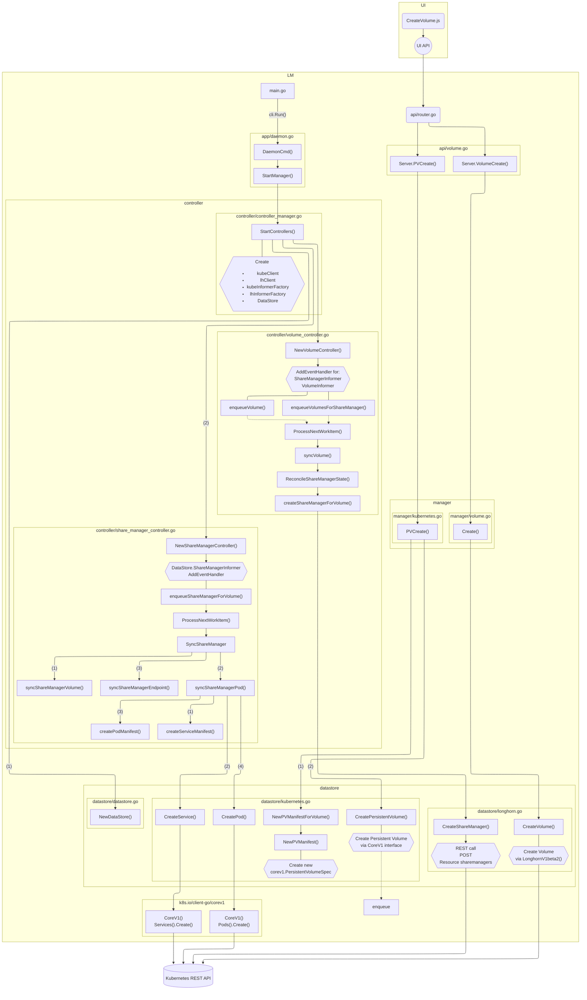

# Title

Object Support for Longhorn

## Summary

By integrating s3gw with Longhorn, we are able to provide an S3-compatible,
Object API to clients consuming Longhorn volumes. This is achieved by creating
an Object endpoint (using s3gw) for a Longhorn volume.

### Related Issues

https://github.com/longhorn/longhorn/issues/4154


## Motivation

### Goals

* Provide an Object endpoint associated with a Longhorn volume, providing an
  S3-compatible API.
* Multiple Object endpoints should be supported, with each endpoint being backed
  by one single Longhorn volume.


### Non-goals

* Integration of s3gw UI for administration and management purposes. Such an
  Enhancement Proposal should be a standalone LEP by its own right.
* Providing Object endpoints for multiple volumes. In this proposal we limit one
  object endpoint per Longhorn volume (see longhorn/longhorn#5444).
* Multiple Object endpoints for a single volume, either in Read-Write Many, or
  as active/passive for HA failover. While we believe it to be of the utmost
  importance, we are considering it future work that should be addressed in its
  own LEP.
* Specify how COSI can be implemented for Longhorn and s3gw. This too should be
  addressed in a specific LEP.

## Proposal

### User Stories

#### Story

Currently, Longhorn does not support object storage. Should the user want to use
their Longhorn cluster for object storage, they have to rely on third-party
applications.

Instead we propose to enhance the user experience by allowing a Longhorn volume
to be presented to the user as an object storage endpoint, without having the
user to install additional dependencies or manage different applications.

### User Experience In Detail

* A new "Create Object Endpoint" button exists in the Volumes page;
* The user clicks on "Create Object Endpoint";
* A modal dialog is shown, with the various Object Endpoint/s3gw related fields;
* User specifies the endpoint name;
* User specifies their username and password combination for the administrator
  user;
    * This can, potentially, be randomly generated as well.
* For publicly accessible endpoints, the user must specify a domain name to be
  used;
* The user must provide SSL certificates to be used by the endpoint.
* Then the user clicks "Ok".

### API changes

The API will need a new endpoint to create an object endpoint, as well as
listing, updating, and deleting them. We believe it's not reasonable to reuse
the existing `/v1/volumes` API endpoints, given they are semantically distinct
from what we are trying to achieve.

We thus propose the creation of a `/v1/endpoint/object` API endpoint. This route
could also be `/v1/object-endpoint`, but we believe that by having a
`/v1/endpoint/...` route we can potentially future proof the API in case other
endpoint types (not just object) are eventually added.


## Design

### Implementation Overview

Integrating Longhorn with `s3gw` will require the creation of mechanisms that
allow us to 1) describe an object endpoint; 2) create a volume to be used for
storage; 3) deploy an `s3gw` pod consuming the created volume; and 4) deploy an
`s3gw-ui` pod for management and administration.

We believe we will need a new Custom Resource Definition, `ObjectEndpoint`,
representing an Object Endpoint deployment, containing information that will be
required to deploy an `s3gw` endpoint, as well as the `s3gw-ui` administration
interface.

Given we require a volume to be created before deploying an `s3gw` instance, we
will need to first trigger volume creation ourselves, meaning creating a new
`longhorn.VolumeSpec` using the parameters we believe to be necessary for proper
`s3gw` execution, and calling on `VolumeManager.Create()` for volume creation.

Having a volume, we can create a new `ObjectEndpoint`, including the volume to
be used. The `ObjectEndpointSpec` will thus include the volume to be claimed,
credentials to be used for the administration interface, SSL certificates,
amongst other things we may need to define at a later stage.

An `ObjectEndpointController` will also be necessary, responsible for creating
and managing `s3gw` pods, both the `s3gw` endpoint and the `s3gw-ui`. This
controller will be listening for new resources of type `objectendpoint`, and
will create the necessary bits for proper deployment, including services and
pods.

#### Custom Resource Definition

It is not clear at this stage what the CRD should look like in detail, but
following the implementation for the existing `ShareManager`, something similar
would likely be desired.

```golang
longhorn.ObjectEndpoint{
    ObjectMeta: metav1.ObjectMeta{
        Name: <string>
    },
    Spec: longhorn.ObjectEndpointSpec{
        Image: <s3gw-image-name>,
        ImageUI: <s3gw-ui-image-name>,
        Credentials: longhorn.ObjectEndpointCredentials {
            AccessKey: <string>,
            SecretKey: <string>,
        },
        PublicDomain: <string>,
        SSLCertificate: <base64-string>,
        Volume: <string>,
    }
}
```

#### Required changes

Aside from what has been discussed previously, we believe we need to add two new
options as arguments to `longhorn-manager`: `--object-endpoint-image`, and
`--object-endpoint-ui-image`, both expecting their corresponding image names.
These will be essential for us to be able to spin up the pods for the object
endpoints being deployed.

Additionally, we will require to add the new `ObjectEndpointController` to
`StartControllers()`, in `controller/controller_manager.go`.

A new informer will need to be created as well, `ObjectEndpointInformer`, adding
it to the `DataStore`, so we can listen for `ObjectEndpoint` resources, which we
will critically need to in the `ObjectEndpointController`.

A new function `ReconcileObjectEndpointState()` may be desirable, to be called
from `VolumeController.syncVolume()`, in `controller/volume_controller.go`.

Finally, we expect to add `s3gw` images as dependencies to be downloaded by
the Longhorn chart.

Further changes may be needed as development evolves.

### Test plan

It is not clear at this moment how this can be tested, much due to lack of
knowledge on how Longhorn testing works. Help on this topic would be much
appreciated.

### Upgrade strategy

Upgrading to this enhancement should be painless. Once this feature is available
in Longhorn, the user should be able to create new object endpoints without much
else to do.

At this stage it is not clear how upgrades between Longhorn versions will
happen. We expect to be able to simply restart existing pods using new images.

### Versioning

Including the `s3gw` containers in the Longhorn chart means that, for a specific
Longhorn version, only a specific `s3gw` version is expected to have been tested
and be in working condition. We don't make assumptions as to whether other
`s3gw` versions would correctly function.

An upgrade to `s3gw` will require an upgrade to Longhorn.

## Note

Below, we can find a flowchart created during the discovery phase that served as
the basis for this proposal's proposed changes. We looked quite a bit into how
Longhorn's `share-manager` works, and we followed much of the same logic, but
applied to `s3gw`.


