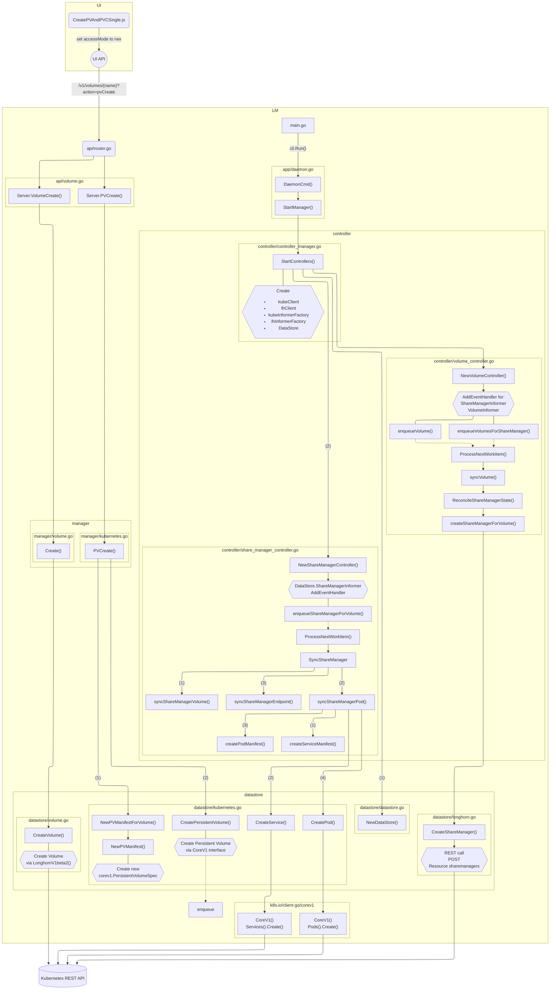

# Title

s3gw integration with Longhorn

## Summary

By integrating s3gw with Longhorn, we are able to provide an S3-compliant API to
clients consuming Longhorn volumes. This is achieved by creating an S3 endpoint
(using s3gw) for a Longhorn volume.

### Related Issues

https://github.com/longhorn/longhorn/issues/4154


## Motivation

### Goals

* Provide an S3 endpoint associated with a Longhorn volume.
* Multiple S3 endpoints should be supported, with each endpoint being backed by
  one single Longhorn volume.


### Non-goals

* Integration of s3gw UI for administration and management purposes. Such an
  Enhancement Proposal should be a standalone LEP by its own right.
* Providing S3 endpoints for multiple volumes. In this proposal we limit one s3
  endpoint per Longhorn volume.
* Multiple S3 endpoints for a single volume, either in Read-Write Many, or as
  active/passive for HA failover.

## Proposal

This is where we get down to the nitty-gritty of what the proposal actually is.

### User Stories

#### Story

Currently, Longhorn does not support object storage. Should the user want to use
their Longhorn cluster for object storage, they have to rely on third-party
applications.

Instead we propose to enhance the user experience by allowing a Longhorn volume
to be presented to the user as an object storage endpoint, without having the
user to install additional dependencies or manage different applications.

### User Experience In Detail

* Using the Longhorn UI, user clicks on "Create Volume";
* User fills the various fields according to their desire;
* User selects S3 as the Frontend;
    * Access Mode becomes fixed at "Read-Write Once";
* User clicks "Ok".

### API changes

The API will need to understand a new `s3` parameter for the `Frontend` field
during volume creation.

## Design

### Implementation Overview

We believe changes to be required in various ways:

* Creating a new `S3Endpoint` Custom Resource Definition;
* Enabling `s3` as a new Frontend for volume creation;
* Creating a new `S3Endpoint` resource (via `client-go` API) with the new s3
  endpoint associated with the newly created volume;
* Creating a `controller/s3endpoint_controller.go`, defining a new
  `S3EndpointController`;
* Listening for new `S3Endpoint` resources in `S3EndpointController`, creating a
  new `Service` and a new `Pod`.


#### Custom Resource Definition

It is not clear at this stage what the CRD should look like in detail, but
following the implementation for the existing `ShareManager`, something similar
would likely be desired.

```golang
longhorn.S3Endpoint{
    ObjectMeta: metav1.ObjectMeta{
        Name: volume.Name,
        Namespace: volume.Namespace
    },
    Spec: longhorn.S3EndpointSpec{
        Image: <s3gw-image-name>,
        ImageUI: <s3gw-ui-image-name>
    }
}
```

#### Required changes

We expect to need to perform the following changes to `longhorn-manager`:

* Introduce two new arguments: `--s3-endpoint-image <image>`, and `--s3-endpoint-image-ui`;
* Create a new `S3EndpointController` in
  `controllers/s3_endpoint_controller.go`, responsible for creating and managing
  `s3gw` pods;
* Add `S3EndpointController` to `controller/controller_manager.go`'s
  `StartControllers()`;
* Introduce a new `S3EndpointInformer` to `DataStore`;
* Create new functions `ReconcileS3EndpointState()` and
  `createS3EndpointForVolume()` in `controller/volume_controller.go`;
* Create new function `CreateS3Endpoint()` in `datastore/longhorn.go`.

Additionally, we expect to add `s3gw` images as dependencies to be downloaded by
the Longhorn chart.

Further changes may be needed as development evolves.

### Test plan

It is not clear at this moment how this can be tested, much due to lack of
knowledge on how Longhorn testing works. Help on this topic would be much
appreciated.

### Upgrade strategy

Upgrading to this enhancement should be painless. Once this feature is available
in Longhorn, the user should be able to create new Volumes with the S3 Frontend
without much else to do.

## Note

Below, we can find a flowchart created during the discovery phase that served as
the basis for this proposal's proposed changes. We looked quite a bit into how
Longhorn's `share-manager` works, and we followed much of the same logic, but
applied to `s3gw`.


